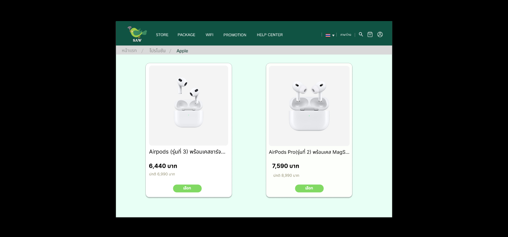
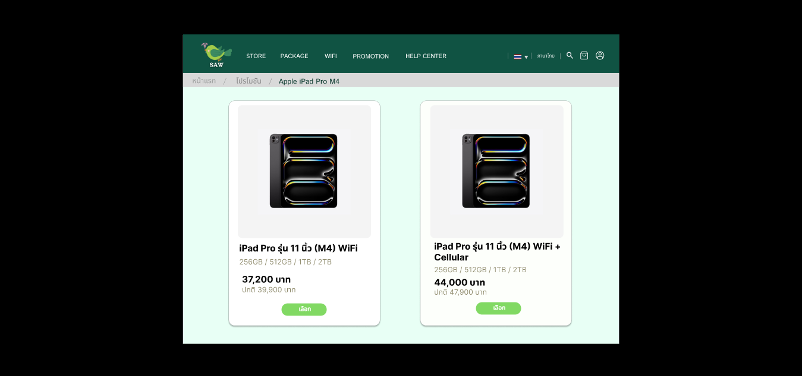

# Project

## IMDB Master Project

## Internet Service System Analysis Project (SAW WIFI AND SERVICE)
Requirements analysis, system design, present plans and models through the interface. The system used in the study and model is the AIS service.
### SAW Figma
https://www.figma.com/proto/pfNwZN8KuMhVvxrj4HOS8a/SAW?node-id=95-832&node-type=canvas&t=ayzwbhz2TY4l4Ka8-0&scaling=contain&content-scaling=fixed&page-id=0%3A1&starting-point-node-id=95%3A832

### SAW Report
[Report](./SA/Saw_Report.pdf)

### Responsible
analyzing the mobile phone purchase system. Design diagrams and interfaces for mobile purchases, and participate in the interface of promotions.
#### Tools
- draw.io
- Figma

Mobile Shop 

Promotion (Figma) 
   

## Software Testing Project
